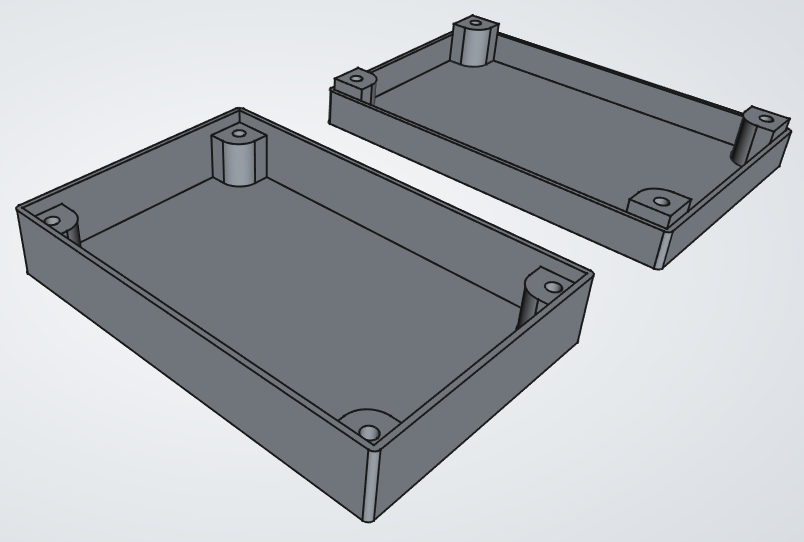

# сase — модель корпуса

FreeCAD-модель простого корпуса с крышкой.
Все значимые размеры в модели задаются параметрически. 

# Формат файла в репозитории

FreeCAD сохраняет файлы в формате **.FCStd**. Это бинарный формат, плохо
подходящий для хранения в репозитории.

Для более эффективного хранения в репозитории бинарный файл **.FCStd** здесь
закодирован в текстовый файл специального формата с тем же расширением
**.FCStd**.

Для кодирования/декодирования используется утилита
[zippey](https://github.com/rockstorm101/zippey).

Готовый декодированный файл в настоящем формате **.FCStd** можно скачать
в [релизах](https://github.com/ivanych/case/releases).
